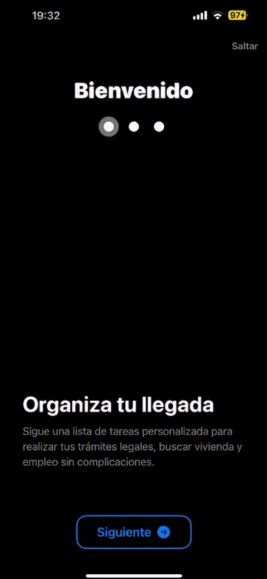
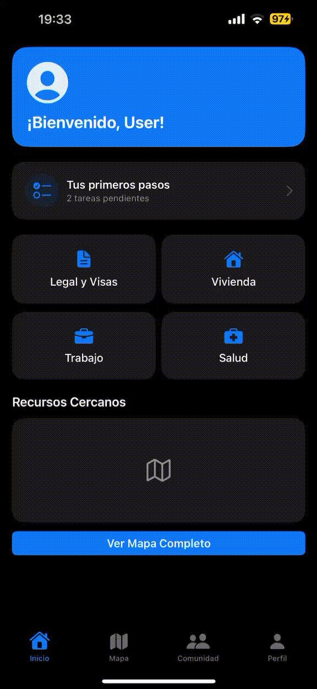

# Klingt

Klingt es una app iOS construida con **SwiftUI** que ayuda a migrantes recién llegados a una
ciudad a organizarse: seguimiento de trámites, mapa de recursos cercanos (legal, salud, comida,
vivienda), un espacio de comunidad para resolver dudas con otras personas, y un perfil con las
publicaciones propias.

## Demo

| Onboarding | Navegación entre tabs |
|---|---|
|  |  |

> Los GIFs viven en la carpeta `Demo/` en la raíz del repo (`Demo/onboarding.gif` y
> `Demo/tabs.gif`). Si les cambias el nombre, actualiza las rutas de arriba.

## Características principales

- **Onboarding** de bienvenida (carrusel de 3 pasos), que se muestra una única vez y puede
  saltarse con "Skip". Puede volver a verse desde **Perfil → ⚙️ Ajustes → Ver introducción de nuevo**.
- **Inicio**: dashboard con progreso de trámites, accesos rápidos (Legal y Visas, Vivienda,
  Trabajo, Salud) y vista previa de recursos cercanos.
- **Mapa**: recursos cercanos (clínicas legales, centros de salud, comedores, vivienda) con
  filtros por categoría y buscador.
- **Comunidad**: feed de publicaciones filtrable por categoría (Vivienda, Trabajo, Historias).
- **Perfil**: datos personales, publicaciones propias, y ajustes.

## Arquitectura

El proyecto sigue **MVVM-C** (Model – View – ViewModel – Coordinator), con un Coordinator por
flujo/tab para que la navegación de cada sección crezca de forma independiente:

```
AppCoordinator                 → decide entre Onboarding y la app principal
├── OnboardingCoordinator      → avance del carrusel de bienvenida
└── MainTabCoordinator         → dueño del TabView
    ├── HomeCoordinator
    ├── MapCoordinator
    ├── CommunityCoordinator
    └── ProfileCoordinator
```

Reglas generales que sigue cada capa:
- **Model**: datos puros, sin lógica de UI ni de navegación (`Resource`, `CommunityPost`, `HomeTask`).
- **View**: solo dibuja UI y reporta intenciones del usuario; nunca decide navegación por sí sola.
- **ViewModel**: contiene el estado de presentación y la lógica de cada pantalla; delega toda
  decisión de "a dónde ir" al Coordinator correspondiente.
- **Coordinator**: decide navegación (push/pop, cambio de flujo); no conoce el contenido de las
  vistas, solo las rutas.

## Estructura de carpetas

```
Klingt/
├── App/                  → entry point, RootView, Core Data stack
├── Coordinators/          → un coordinator por flujo/tab
├── Models/                → datos puros
├── Services/              → acceso a datos (mock por ahora, listos para conectar a un backend real)
├── Features/              → una carpeta por pantalla/flujo (View + ViewModel juntos)
│   ├── Onboarding/
│   ├── Home/
│   ├── Map/
│   ├── Community/
│   └── Profile/
└── UIComponents/          → botones y estilos reutilizables
```

## Requisitos

- Xcode 16+
- iOS 17+ (uso de `NavigationStack`, `Map` con `MapCameraPosition`, `@Observable` donde aplique)

## Cómo correrlo

1. Clona el repositorio.
2. Abre `Klingt.xcodeproj` (o `.xcworkspace` si aplica) en Xcode.
3. Selecciona un simulador de iOS 17+ y presiona Run (`Cmd + R`).

